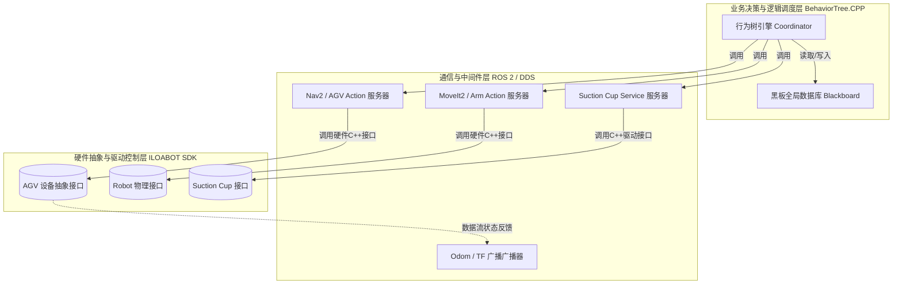
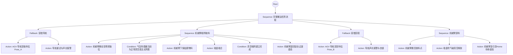
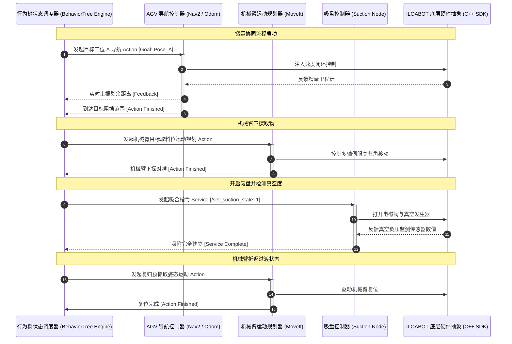

# 基于 ROS 2 DDS 与行为树的复合机器人（AGV + 机械臂 + 末端执行机构）控制系统项目启动书

---

## 1. 项目概述

### 1.1 项目背景
在当代半导体、高精制造和智慧仓储物流等场景中，单一的移动底架（AGV）或独立的固定式机械臂已无法满足跨工位、动态抓取和柔性生产的需求。以本项目为基础，旨在利用 ROS 2 优秀的智能分布式进程通信特性、底层的 DDS (Data Distribution Service) 数据分发总线，以及 BehaviorTree (行为树) 状态控制引擎，将现有的硬件设备驱动抽象和通信中间件进行深度整合与重构。

通过本项目的建设，将原有的单机硬件接口（例如 [include/iloabot/devices/agv.h](include/iloabot/devices/agv.h)、[include/iloabot/devices/robot.h](include/iloabot/devices/robot.h)、[include/iloabot/devices/suction_cup.h](include/iloabot/devices/suction_cup.h) 等定义的控制逻辑）提升并封装为跨网络、高实时、高内聚、硬容错的自治复合机器人软件控制系统。

### 1.2 业务与技术目标
- **业务目标**：实现 AGV 自主导航、目标工位精确定位、机械臂视觉引导柔性规划、末端执行机构（吸盘）精准抓取与放置的闭环无缝协同作业。
- **技术目标**：
  1. **零丢包高实时通信**：底层基于开源或商业 DDS 实现亚毫秒级的数据同步和高安全服务质量约束（QoS）。
  2. **高柔性业务调度**：应用层采用基于 BehaviorTree.CPP (v4.x) 动作引擎，业务层零代码或低代码编写即可快速重构工业流程。
  3. **标准 ROS 2 骨干网**：遵循 ROS 2 Humble/Iron 规范，封装标准 Action、Service 及 Topic 接口，全面兼容 MoveIt 2（机械臂规划）与 Nav2（AGV自主导航框架）。

---

## 2. 系统总体架构设计

复合移动机器人的控制软件采用分层架构设计。自底向上依次为：硬件设备与物理驱动层、设备抽象层（ILOABOT SDK）、通信中间件与核心节点层（ROS 2 DDS）、以及高层业务智能决策与协同控制层（BehaviorTree）。

### 2.1 软件架构拓扑



### 2.2 软硬件核心映射与代码引用
当前底盘、机械臂与末端的软硬件驱动在工作区中已定义了健全的 C++ 底群。项目初期将对以下底层接口进行 ROS 2 Node 节点外壳的封装：
- **AGV 底盘控制**：封装 [include/iloabot/devices/agv.h](include/iloabot/devices/agv.h) 与 [include/iloabot/devices/agv002.h](include/iloabot/devices/agv002.h)，利用底层的速度控制器与里程计实现，将底层接口映射至 ROS 2 的 /cmd_vel 与 /odom 数据通道。
- **机械臂轨迹运动**：封装 [include/iloabot/devices/robot.h](include/iloabot/devices/robot.h) 与 [include/iloabot/devices/robot002.h](include/iloabot/devices/robot002.h)，对接 JointState 与位置环、速度环等基础控制模式，通过 sensor_msgs/msg/JointState 输出关节角，并挂载 MoveIt 2 控制器。
- **末端吸盘控制**：封装 [include/iloabot/devices/suction_cup.h](include/iloabot/devices/suction_cup.h) 与 [include/iloabot/devices/suction_cup002.h](include/iloabot/devices/suction_cup002.h)，实现对吸盘开/关、气压检测和故障检测控制接口，提供 ROS 2 Service 控制通道。

---

## 3. DDS 通信与接口设计 (ROS 2 / Middleware)

底层在复杂的工业现场需要面对大量的电磁干扰和多变的网络延迟，依靠高弹性、高可配的 DDS 服务保障底层控制环不失步。

### 3.1 核心 QoS 策略配置图
为了确保各核心通信主题在不同的网络状况下均可稳定触达，系统遵循如下 QoS 配置原则：

| 主题/服务类型 | 数据流特征 | 建议 QoS 策略 (DDS Layer) | 核心指标 |
| :--- | :--- | :--- | :--- |
| **传感器数据/里程计** (/odom, /joint_states) | 高频、极高时效、允许少量丢包 | **Reliability**: Best Effort<br>**History**: Pull Last 1<br>**Durability**: Volatile | 亚毫秒递交 |
| **控制指令** (/cmd_vel, 机械臂关节直接目标) | 极高实时、不容许长时延迟积压 | **Reliability**: Reliable<br>**History**: Keep Last 3<br>**Deadline**: 20ms | 20毫秒生命周期 |
| **任务级动作 / 控制服务** (Nav2, MoveIt2 Action/Service) | 低频、必须确保 100% 可靠交付 | **Reliability**: Reliable<br>**History**: Keep All<br>**Durability**: Transient Local | 绝对可靠、持久化状态 |

### 3.2 节点核心通信接口表（API Interface）

```
[复合控制节点] <--- (ROS2 Actions) ---> [Nav2导航 / MoveIt2运动规划 / 状态监控]
```

- **移动导航 Actions (AGV)**
  - Topic/Action Name: /navigate_to_pose
  - Action Type: nav2_msgs/action/NavigateToPose
  - 描述: 控制 AGV 底盘移动到指定目标坐标，提供路径计算进度和实时距离偏差反馈。
- **关节空间及空间笛卡尔路径控制 Actions (机械臂)**
  - Topic/Action Name: /execute_trajectory
  - Action Type: control_msgs/action/FollowJointTrajectory
  - 描述: 控制机械臂运行由 MoveIt 2 计算生成的无碰撞轨迹。
- **气动吸盘夹持控制 Services (末端执行机构)**
  - Topic/Action Name: /set_suction_state
  - Service Type: iloabot_msgs/srv/SetSuction
  - 描述: 请求参数含 uint8 action_mode（0-释放、1-吸合、2-检测气压值），返回 bool success。

---

## 4. 行为树逻辑与控制设计 (BehaviorTree)

高层业务控制基于 BehaviorTree.CPP 动作组件库进行部署，通过组合以下三种基础树节点，以纯逻辑、非阻塞的形式调度多设备协同作业。

### 4.1 全局业务流程行为树拓扑



### 4.2 行为树（BehaviorTree）节点关键设计说明 (BT Node Plugins)

在本项目中，所有叶子节点均为继承自 BT::CoroActionNode 或 BT::StatefulActionNode 的 C++ 插件，其核心逻辑将与底层的 ROS 2 Action 客户端交互。

#### 1. 行为树动作节点 (Action Nodes)
- NavToPose / **AGV导航动作**:
  - **输入参数 (Ports)**: goal_pose (含 x, y, theta 维度的三维欧拉姿态)
  - **动作流程**: 节点启动时向 /navigate_to_pose 发送异步目标；在 tick() 函数中获取控制位置反馈，并将当前的偏差距离持续送返行为树全局黑板；若检测到反馈数据发生意外阻碍物报警，节点返回 FAILURE 状态，触发行为树 Fallback 回调。
- ArmMoveToPose / **机械臂规划动作**:
  - **输入参数 (Ports)**: target_joint_group / target_pose
  - **动作流程**: 通过调用底层的 [include/iloabot/devices/robot.h](include/iloabot/devices/robot.h) 或 MoveIt 2 服务，执行无碰撞逆解运算，并通过 FollowJointTrajectory 控制机械臂行进。
- ControlSuction / **吸盘收放动作**:
  - **输入参数 (Ports)**: switch_state (1-吸合 / 0-吹气释放)
  - **动作流程**: 在 tick() 中向 /set_suction_state 发起非阻塞服务请求（Service Call）。在吸盘内部的微孔探深后，该节点将周期性轮询底层的状态寄存器。

#### 2. 条件观测节点 (Condition Nodes)
- IsSuctionClamped / **真空建立完成条件**:
  - 基于 [include/iloabot/devices/suction_cup.h](include/iloabot/devices/suction_cup.h) 中的 GetPressure() 或者高频物理反馈节点，周期性验证压力值是否跃迁并维持到预设的安全极限负压阈值之下（如 <= -60 kPa），用以动态确认取料是否成功。
- IsAGVCharged / **AGV 极低电量校验**:
  - 读取 [include/iloabot/devices/battery.h](include/iloabot/devices/battery.h) 输出的电量百分比，避免搬运中途失电而导致悬挂。

#### 3. 共享黑板变量 (Blackboard Data Map)
行为树中所有节点通过全局线程安全的 Blackboard 实现高时效的数据透传：
- pose_pickup / pose_dropoff: 由上位机或内部标定预设的目标物理坐标。
- system_status: 当前软件控制状态字。
- suction_vacuum_kpa: 实时数字负压反馈，用于条件实时判断控制。

---

## 5. 系统核心控制逻辑交互时序



---

## 6. 项目阶段、里程碑与进度管理

整个项目周期预计为 12 周，划分为 4 个主要递进开发阶段：

### 阶段一：底层架构与抽象封装（第 1 - 3 周）
- **主要内容**：
  - 构建项目基础 ROS 2 工作空间，将现有 [include/iloabot/devices/agv.h](include/iloabot/devices/agv.h)、[include/iloabot/devices/robot.h](include/iloabot/devices/robot.h) 等硬件驱动以 ROS 2 Library Node 的形式进行隔离接入。
  - 完成底盘及关节控制器的环抱控制，定义好基础 DDS 节点、底层 QoS 策略及所需的自定义 Service / Action 数据通讯消息体。
- **里程碑 1**：实现单体驱动在 ROS 2 Humble 下通过指令、遥控节点的正确控合，无延迟卡顿。

### 阶段二：机器人感知、导航与运动规划集成（第 4 - 6 周）
- **主要内容**：
  - 基于激光雷达、IMU，利用 Nav2 在目标场地中建立高精地图，配置好 AGV 代价图参数以实现动态避障定位。
  - 接入 MoveIt 2 配置，进行机械臂正逆运动学求解，建立末端法兰与底架在 tf2 坐标树中的标定，调试避障三维包络盒。
- **里程碑 2**：AGV 导航精度优于预期误差，且机械臂无碰撞路径规划成功率达 95% 以上。

### 阶段三：行为树调度器（BT Engine）开发（第 7 - 9 周）
- **主要内容**：
  - 编写 BehaviorTree.CPP 叶子节点插件：NavToPose、ArmMoveToPose、ControlSuction 等，对节点状态和共享黑板读写逻辑行压力测试。
  - 创建可视化行为树流程描述 XML 结构，测试对于非阻塞、意外跌落、机械臂奇异点等典型工程边界事件下的回溯与安全机制。
- **里程碑 3**：完成行为树在逻辑层和仿真器下的无缝协同控制流程。

### 阶段四：实机联合调试、优化与定型（第 10 - 12 周）
- **主要内容**：
  - 在工业环境下进行物理样机协同总调：测试长时间高强度复合搬运。
  - 性能诊断：采集大负压变化下 DDS 发布高并发数据的抖动率，针对运动学算法开辟专用硬核实时调度线程。
- **里程碑 4**：完成所有联合验收测试，软件符合上线生产工艺条件，完成完整的开发与运维文档、控制协议手册的交付。

---

## 7. 风险预测与应对预案

1. **多重坐标标定带来的空间定位误差累积**：
   - *问题预测*：由于 AGV 自主定位抖动（在 +/- 5 mm 左右），会直接反馈并累加到机械臂末端上，导致吸盘在接近工位时偏离中心。
   - *应对策略*：在机械臂末端（Eye-in-Hand Configuration）处加装单目/双目传感器，通过手眼标定与轻量化图像检测算法（如 Apriltag 识别），在末端下探的最后 50 mm 阶段进行自主高精自适应对准和运动补偿。
2. **DDS 网络分发延迟过高或丢包**：
   - *问题预测*：工业多径效应导致无线 Wi-Fi 信号跌落。
   - *应对策略*：部署专属 DDS 通信网并约束 QoS 策略（为关键控制流采用 Transient 级高容错），在行为树控制心跳丢失触发（>= 100 ms 未响应状态下）自动安全脱挂挂载，底层电机自动刹车抱闸死锁，防止由于断连发生侧倾或机械撞击事故。
3. **吸附期间因气压轻微断崖式泄露导致摔件**：
   - *问题预测*：物料由于表膜粗糙度变化、气密不好，导致搬运中途失压摔片。
   - *应对策略*：由条件观测节点周期性监控底座数显负压，在临界负压发生跌落时，行为树第一优先级调用急停或者原位轻放的逻辑（安全回落并切换声光提示），最大限度降低部件损失。
